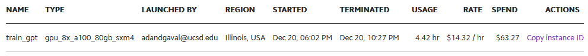
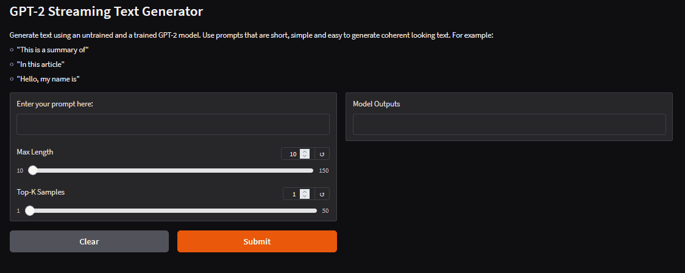
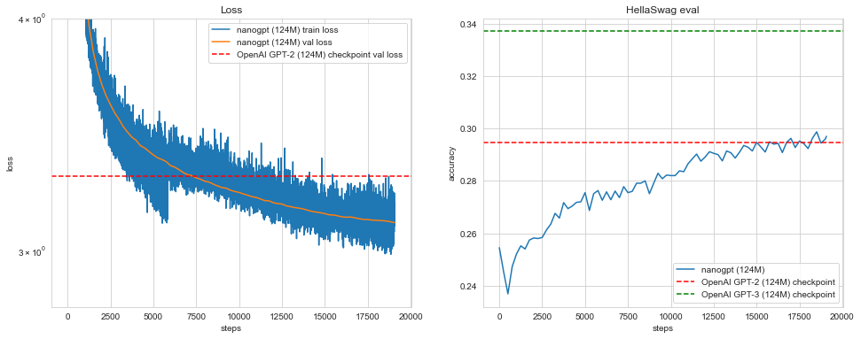

# miniLLM

This project implements **GPT2-124M** from scratch and trains it  using distributed training principles on a cloud cluster of **8× 80GB NVIDIA A100** GPUs. The entire training process was completed in **~3.5 hours** on **10 Billion tokens**.

1. **Model**: [GPT-2 (124M)](https://github.com/openai/gpt-2)
2. **Dataset**: [FineWebEdu](https://huggingface.co/datasets/HuggingFaceFW/fineweb-edu) 
3. **Hardware**: 8× 80GB NVIDIA A100 GPUs  
4. **Training Time**: ~3.5 hours
5. **Downloading and Sharding the Dataset:** ~1.25 hr
6. **Distributed Strategy**: Data parallelism

Cloud usage



## Try it yourself
Try the gradio app to compare a trained and untrained GPT2 model [here](https://huggingface.co/spaces/AseemD/gpt2). 



## Repository Structure

```
.               
├── eval/
│   ├── hellaswag.py             # Functions for running the HellaSwag eval
|
├── data/
│   └── dataset.py               # DataLoader definition
│   └── fineweb.py               # Download and shard the FineWebEdu-10B dataset
|
├── images/
│   ├──results.png               
│   ├──cloud_usage.png
│   ├──gradio-app.png
|
├── train.py                     # Script to train the model 
├── utils.py                     # Utility functions used in training
├── model.py                     # GPT2-124M model definition
├── app.py                       # Gradio app  
└── README.md                    # Project documentation 

```

## Results

After training for 10B tokens, this model achieved lower validation loss and higher accuracy on the HellaSwag eval than the openai GPT2-124 checkpoint.



Final Training steps and Metrics:

```
step 19067 | loss: 3.103271 | lr 6.0000e-05 | norm: 0.2596 | dt: 555.33ms | tok/sec: 944104.07
step 19068 | loss: 3.186379 | lr 6.0000e-05 | norm: 0.2834 | dt: 556.82ms | tok/sec: 941571.89
step 19069 | loss: 3.118728 | lr 6.0000e-05 | norm: 0.2621 | dt: 556.35ms | tok/sec: 942368.40
step 19070 | loss: 3.121482 | lr 6.0000e-05 | norm: 0.2625 | dt: 556.40ms | tok/sec: 942278.35
step 19071 | loss: 3.138492 | lr 6.0000e-05 | norm: 0.2628 | dt: 556.23ms | tok/sec: 942578.85

validation loss: 3.1078
HellaSwag accuracy: 2982/10042=0.2970
```

Before any training:

```
This is a summary about wont sublimeettlerider Hera Citiz Links operationhittingBrainLeague enginesitalscies solve neglect missions soar abortionouls supernaturalfitolding Recogngithub
This is a summary aboutbinary Emb PI Cindy secure shades referencing IPOrenowers McF medicine interrupts hurry billing successfully submission academiceful locovy molecule416specplementation
This is a summary about Presence matanded Languages roomm rapport lb ranchitt Granderans policy Twice Gift then Questions fendFordhtarloe mixed Optional prud tsp especially
This is a summary aboutWo rumorsOption mineral mindlesstaker harrowing accidents>< ceremonamped nm erad Slater Panama431Dave mineruggish bandits RangersRus Cole silence0001
This is a summary about consent simBytesembedreportprint Bundesligaarantine sidelined776nceRay cues Ho duo seizing delve intest hill juggling finalists seeker meteorOct+)asonablemajor
```

And after 10 Billion tokens of training:

```
> This is a summary about the different components of a health-care continuum. Diseases occur more often with some chronic illnesses. In this
> This is a summary about how our species is evolving. We already know the different traits of different breeds that we are working on using the resources we have
> This is a summary about how to properly format my own thoughts. For example, my first paragraph is about my thoughts on the topic. There are
> This is a summary about the topic. The term 'fraud' is used to describe any scheme by which someone with a computer file has
> This is a summary about the use of and the impacts of oil and gas: As a long-term investment, oil and gas infrastructure is already
```

## Acknowledgments
This project was made following the  tutorial on youtube and the  repo.

## License
This project is licensed under the MIT License.
    

